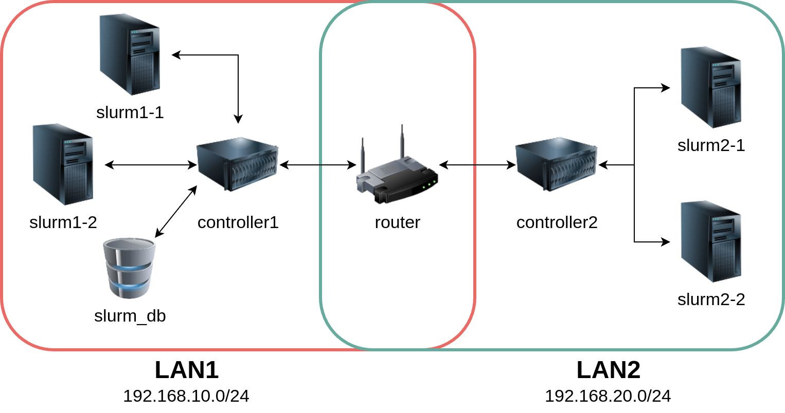

### Attività di tirocinio presso [ULISSE](https://ulisse.unibo.it/)

Infrastruttura virtuale sviluppata per l'integrazione di funzionalità [SLURM](https://slurm.schedmd.com/overview.html).

Per maggiori informazioni, consultare la [presentazione](docs/Presentazione.pdf) e la [relazione di fine tirocinio](docs/Relazione.pdf).

> [!NOTE]
> Basato su codice di [Andrea Giovine](https://www.unibo.it/sitoweb/andrea.giovine).